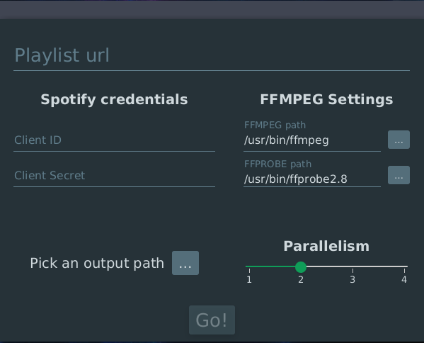
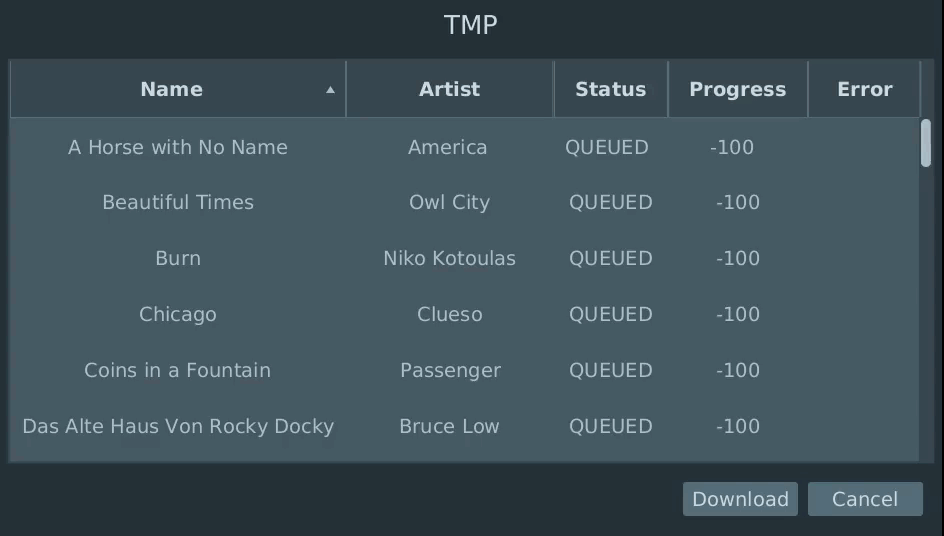

## About
This is a small toy project to look up a spotify playlist on youtube and download that audio.

## Screenshots

### Main UI

### Download UI

## Dependencies
* RxJava (Reactive extensions for java)
* RxKotlin (Reactive extensions for kotlin)
* Youtube-Dl (Youtube download)
* MP3agic (ID3-Tags)
* Spotify-Web-Api-Java (Spotify interaction)
* NewPipeExtractor (Youtube parsing)
* JFoenix (Material design)
